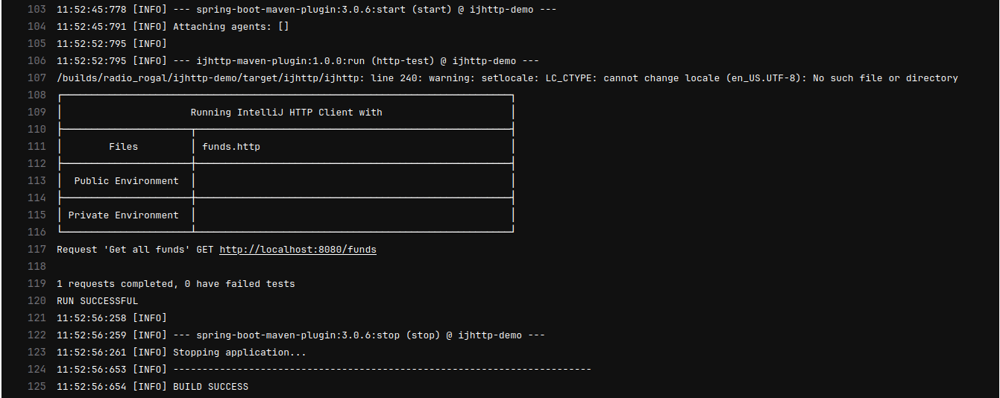
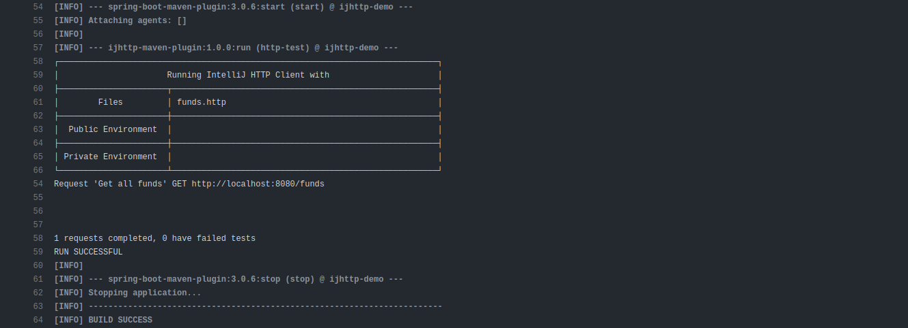

# IntelliJ HTTP Client Demo

This is a demo project to show using of [IntelliJ HTTP Client][ijhttp] CLI.
Further reading about [HTTP Client][http-client].

## How to run IntelliJ HTTP Client...

### ... on Maven project ...

There are two options: run it with `exec-maven-plugin` and `ijhttp-maven-plugin`.
Both require to install or download **IntelliJ HTTP Client CLI**.
I use `download-maven-plugin` to download it.

#### … with `exec-maven-plugin`

```bash
./mvnw -Pdownload-ijhttp,spring-boot,exec
```

#### … with `ijhttp-maven-plugin`

```bash
./mvnw -Pdownload-ijhttp,spring-boot,maven-plugin
```

## ... on GitLab CI

There is `.gitlab-ci.yml` who downloads and unpacks `ijhttp` them runs it.

```yaml
http-test:
  stage: test
  script:
    - microdnf install unzip
    - curl -f -s -L -o ijhttp.zip https://jb.gg/ijhttp/latest
    - unzip -nq ijhttp.zip -d target
    - rm ijhttp.zip
    - mvn $MAVEN_CLI_OPTS verify -Pspring-boot,maven-plugin
```

Example:


Another option use a Docker image but remember that you need to build the jar before this task.

```yaml
http-test-on-docker-image:
  image:
    name: jetbrains/intellij-http-client:latest
    entrypoint: [""]
  stage: integration-test
  before_script:
    - java -jar target/ijhttp-demo-1.0.0-SNAPSHOT.jar &
    - while ! nc -z localhost 8080 </dev/null; do sleep 5; done
  script:
    - java -cp "/intellij-http-client/*" com.intellij.httpClient.cli.HttpClientMain --report funds.http
  artifacts:
    reports:
      junit:
        - reports/report.xml
```

## Using with GitHub CI

There is `.github/workflows/maven.yml` who downloads and unpacks `ijhttp` them runs it.

```yaml
steps:
- uses: actions/checkout@v3
- name: Download ijhttp
  run: curl -f -s -L -o ijhttp.zip https://jb.gg/ijhttp/latest
- name: Unpack ijhttp
  run: unzip -nq ijhttp.zip -d target
- name: Remove ijhttp.zip
  run: rm ijhttp.zip
- name: Set up JDK 17
  uses: actions/setup-java@v3
  with:
    java-version: '17'
    distribution: 'temurin'
    cache: maven
- name: Build with Maven
  run: mvn verify -ntp -Pspring-boot,maven-plugin
```

Example:


And of couse you can use a Docker image. This job needs the jar from another regular job with Maven.

```yaml
jobs:
  build:

    runs-on: ubuntu-latest

    steps:
    - uses: actions/checkout@v3
    # some maven actions
    # ...
    - name: Temporarily save test requests
      uses: actions/upload-artifact@master
      with:
        name: tests
        path: funds.http
        retention-days: 1
    - name: Temporarily save target
      uses: actions/upload-artifact@master
      with:
        name: target
        path: target
        retention-days: 1

  integration-test:

    runs-on: ubuntu-latest
    needs: build
    container:
      image: jetbrains/intellij-http-client:latest

    steps:
      - name: Retrieve saved test requests
        uses: actions/download-artifact@master
        with:
          name: tests
          path: .
      - name: Retrieve saved target
        uses: actions/download-artifact@master
        with:
          name: target
          path: target
      - name: Run the application
        run: java -jar target/ijhttp-demo-1.0.0-SNAPSHOT.jar &
      - name: Wait the application
        run: while ! nc -z localhost 8080 </dev/null; do sleep 5; done
      - name: Run tests
        run: java -cp "/intellij-http-client/*" com.intellij.httpClient.cli.HttpClientMain --report funds.http
```

[ijhttp]: https://www.jetbrains.com/help/idea/http-client-cli.html "HTTP Client CLI"

[http-client]: https://www.jetbrains.com/help/idea/http-client-in-product-code-editor.html "HTTP Client"

